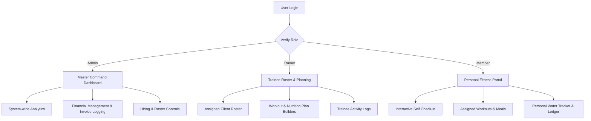

# Product Requirements Document (PRD)
## Project: TITAN Gym Management System (GMS)
**Status:** Approved  
**Version:** 1.0.0  
**Last Updated:** May 31, 2026  

---

## 1. Executive Summary & Vision

The **TITAN Gym Management System (GMS)** is a premium, high-octane enterprise platform designed for modern fitness clubs, boutique training centers, and strength labs. In an industry flooded with clean but sterile "SaaS-white" templates, TITAN GMS establishes a bold, commanding **High-Octane Industrial Aesthetic**—characterized by a striking high-contrast dark theme, aggressive branding, deep grays, rich black tones, and vibrant accent colors (Lime Green / Neon Yellow).

Beyond its visual prowess, TITAN GMS provides a robust, production-grade management engine featuring full **Role-Based Access Control (RBAC)** across three distinct system roles: **Administrators**, **Trainers**, and **Members**. The system bridges the gap between back-office management (payments, roster logistics, attendance check-ins) and client engagement (workout allocation, reactive nutrition tracking, hydration logging) into a single, cohesive full-stack web application.

---

## 2. Product Architecture & User Roles

The product is built around strict data segregation and tailored user journeys to ensure absolute security and role-specific utility.

### 2.1 Admin (Master Command Center)
The Administrative role is the master controller of the facility, responsible for high-level operations, finance, and staffing.
* **Master Dashboard View:** Comprehensive revenue, active member count, trainer statistics, and overall check-in charts.
* **Staffing Controls:** Exclusive permissions to hire, overview, and terminate trainers.
* **Member Onboarding:** Exclusive rights to register new members, assign their default trainer, set subscription types, and track membership expiration dates.
* **Financial Ledger:** Capability to record payment transactions, review invoice history, and generate print-ready receipts.

### 2.2 Trainer (Trainee Roster & Planning)
The Trainer role focuses on athlete coaching, progress monitoring, and specialized planning.
* **Trainee Roster View:** A scoped list displaying *only* the members assigned to them, hiding global administrative actions.
* **Trainee Analytics:** Scoped dashboard metrics focusing on active trainee count, trainer ratings, and trainee check-in patterns.
* **Plan Assignment Engine:** Capability to create, review, and delete custom workout routines and precision nutrition plans for their roster.

### 2.3 Member (Personal Fitness Portal)
The Member role represents a self-service athlete hub designed to maximize engagement and daily usage.
* **Personalized Dashboard:** Hides all gym revenue and staff analytics. Displays a premium Membership Card (active status, renewal timer, plan tier), real-time self check-in widget, and dynamic progress metrics.
* **Workout & Diet Library:** View-only access to custom workout regimens and meal schedules curated by their assigned trainer.
* **Interactive Water Tracker:** A daily gamified macro logger to log water intake, track hydration percentage, and edit targets.
* **Invoice History:** Direct view-only log of payments made and pending dues, with the ability to download receipts.

---

## 3. Core Functional Requirements

### 3.1 Authentication & Access Control
* **Secure Login/Signup:** Email and password-based login featuring robust JWT verification.
* **Navigation Guards:** Automatic frontend client routes validation (`<ProtectedRoute />`). Redirects users attempting to bypass role permissions back to their designated homepage.
* **Backend Endpoint Scoping:** Strict validation on controllers ensuring that role permissions are verified before processing databases requests.

### 3.2 Member & Trainer Directory
* **Search & Filter:** Multi-field live query capability supporting searches by name, email, specialization, or status.
* **Tab-Based Status Filter:** Sleek status toggling (e.g. *All*, *Active*, *Inactive*) on membership tables to improve search efficiency.
* **Assigned Workflows:** Ability to assign a trainer to a member during onboarding, creating a relationship that drives scoped rosters on the trainer dashboard.

### 3.3 Attendance & Self-Service Check-In
* **Manual Override scan:** Admins and trainers can manually scan check-ins/check-outs for members in case of card loss.
* **Self-Service Check-In Widget:** Accessible on the Member Dashboard. Offers a single-tap "Check In" button when absent, automatically generating an active session, and a "Check Out" button when active.
* **Logs Persistence:** Stores check-in date, time, check-out time, and status (*Present*).

### 3.4 Financial Ledger & Invoice Management
* **Manual Transaction Logger:** Admins can log transactions indicating amount, payment method (Credit Card, PayPal, Cash), and payment status (Paid, Pending).
* **Automated Invoice Receipt:** Generates a professional, print-ready, high-octane receipt modal containing membership breakdown, total paid, date of invoice, transaction ID, and digital signature.
* **Dues Countdown:** Visual indicator of renewal and overdue status.

### 3.5 Plan Allocation (Workout & Diet)
* **Custom Routines:** Supports multi-day workout design outlining exercise names, target sets, and repetition ranges.
* **Precision Nutrition:** Allows creation of targeted diet schedules specifying calories, target macro ratios (Protein, Carbs, Fats), and scheduled meal rows (Breakfast, Lunch, Dinner).
* **Interactive Hydration Logger:**
  - Standard logging buttons (`+250ml`, `+500ml`).
  - Safe decrement button (`-250ml`) that displays only when current intake is above 0, preventing negative intake.
  - Interactive daily target editor directly on the macro card to allow adjustments (e.g., from 4.0L to 3.0L) inline.
  - Automatic daily reset based on client system date.

---

## 4. User Experience (UX) & Design Guidelines

To match the **High-Octane Industrial** vision, the system must adhere to strict visual principles:

* **Dark Theme Dominance:** Deep backgrounds (`#0B0B0C`, `#121214`) contrasted with card containers using `#1A1A1E`.
* **Accent Palette:** Primary brand color `#D4FF00` (Electric Lime / Titan Yellow) paired with subtle utility colors (Protein: Blue, Carbs: Yellow, Fats: Red).
* **Modern Typography:** High-contrast sans-serif typefaces (e.g., Outfit, Inter) using bold weightings, black uppercase headers, and geometric structures.
* **Custom Modals:** Native browser dialogs (e.g. `confirm()`, `alert()`) are **prohibited**. All interactive decisions (deleting members, plan removal) must utilize a custom dark-themed `ConfirmModal` featuring smooth animations.
* **State Notifications:** Real-time feedback via clean, floating notifications (e.g., `react-hot-toast`) indicating successful logs, errors, and system status changes.

---

## 5. Non-Functional Requirements

* **Performance & Speed:** Initial page load speed must be sub-1.5s in standard network conditions. Client-side state transitions should feel instant, optimized by Redux Toolkit.
* **Responsiveness:** Fluid scaling from high-resolution desktop terminals down to mobile devices, ensuring that coaches can check rosters on the gym floor and members can check in on their smartphones.
* **Data Privacy:** Scoped access patterns ensuring a member cannot access other members' payment details or attendance logs under any circumstances.
* **Robust Offline Mocking:** The system must gracefully boot and operate on mock storage (`db.json` lowdb equivalent) in local offline environments when an active connection to MongoDB Atlas is unavailable.

---

## 6. Future Enhancements & Product Roadmap

* **QR Code Scanners:** Self-service physical gym scanners that read membership QR codes on member dashboards for touchless check-in.
* **Push Notifications & Subscription Reminders:** Automatic WhatsApp, Email, or Web Push reminders 5 days prior to membership expiration.
* **Payment Gateway Integration:** Direct Stripe/Razorpay SDK integration allowing members to renew directly from their billing dashboard.
* **AI Gym Buddy:** AI-powered model analyzing member goals, current weight, and check-in consistency to recommend specialized workout routines and meal templates.
