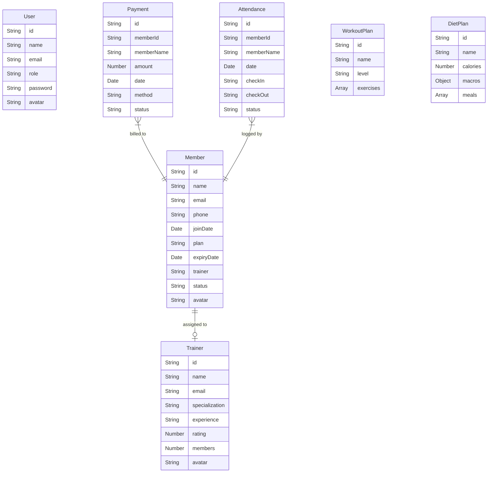

# Technical Requirements Document (TRD)
## Project: TITAN Gym Management System (GMS)
**Status:** Approved  
**Version:** 1.0.0  
**Last Updated:** May 31, 2026  

---

## 1. System Architecture & High-Level Design

The **TITAN Gym Management System** utilizes a client-server architecture built on the MERN Stack (MongoDB, Express, React, Node.js). 

```
                               +-----------------------------+
                               |     Client Terminal (SPA)   |
                               |    React + Redux + Tailwind |
                               +--------------+--------------+
                                              |
                                              |  HTTPS / REST + JWT
                                              v
                               +--------------+--------------+
                               |       Express API Gateway   |
                               |      JWT & Role Middleware  |
                               +--------------+--------------+
                                              |
                       +----------------------+----------------------+
                       | Mongoose Connect                            | File Sync (Seeding)
                       v                                             v
        +--------------+--------------+               +--------------+--------------+
        |   MongoDB Atlas Database    |               |   Local JSON Database        |
        |   (Primary Production DB)   |               |   (db.json - Offline Mock)   |
        +-----------------------------+               +-----------------------------+
```

### 1.1 Client Layer (Frontend SPA)
* **Framework:** React.js bootstrapped with Vite for instant Hot Module Replacement (HMR) and optimized Rolldown production bundles.
* **Routing:** Single Page Routing using `react-router-dom` with hierarchical protected route wrappers.
* **State Engine:** Redux Toolkit providing centralized slice state management (`authSlice`, `gymSlice`) and middleware-driven asynchronous side effects (`createAsyncThunk`).
* **Design System:** Custom styled utility wrappers backed by Tailwind CSS for high-octane dark-mode styling and micro-interactions.

### 1.2 Server Layer (Backend API)
* **Runtime:** Node.js environment.
* **Framework:** Express.js RESTful API serving endpoints under the `/api` namespace.
* **Security:** JSON Web Tokens (JWT) for stateless session validation, supplemented by customized role middleware for endpoint protection.
* **Database Access:** Mongoose Object Document Mapper (ODM) enforcing schematic structure, validations, and query filters.

---

## 2. Database Models & Schema Specifications

The database layer consists of 7 core models managed via Mongoose.



### 2.1 User Model (`server/models/User.js`)
Handles credential storage, authentication, and global system authorization.
```javascript
const UserSchema = new mongoose.Schema({
  name: { type: String, required: true },
  email: { type: String, required: true, unique: true },
  role: { type: String, enum: ['admin', 'trainer', 'member'], default: 'member' },
  avatar: { type: String },
  password: { type: String, required: true }
});
```

### 2.2 Trainer Model (`server/models/Trainer.js`)
Tracks trainer metrics, specialization details, and overall training score.
```javascript
const TrainerSchema = new mongoose.Schema({
  name: { type: String, required: true },
  email: { type: String, required: true, unique: true },
  specialization: { type: String, required: true },
  experience: { type: String, required: true },
  rating: { type: Number, default: 5.0 },
  members: { type: Number, default: 0 },
  avatar: { type: String }
});
```

### 2.3 Member Model (`server/models/Member.js`)
Holds biological data, subscription timers, current trainer linkage, and account status.
```javascript
const MemberSchema = new mongoose.Schema({
  id: { type: String, unique: true },
  name: { type: String, required: true },
  email: { type: String, required: true, unique: true },
  phone: { type: String, required: true },
  joinDate: { type: String, required: true },
  plan: { type: String, required: true },
  expiryDate: { type: String, required: true },
  trainer: { type: String, default: 'None' },
  status: { type: String, enum: ['Active', 'Inactive'], default: 'Active' },
  avatar: { type: String }
});
```

### 2.4 Payment Model (`server/models/Payment.js`)
Maintains gym transaction ledger, status tracking, and receipt validation.
```javascript
const PaymentSchema = new mongoose.Schema({
  id: { type: String, unique: true },
  memberId: { type: String, required: true },
  memberName: { type: String, required: true },
  amount: { type: Number, required: true },
  date: { type: String, required: true },
  method: { type: String, enum: ['Credit Card', 'PayPal', 'Cash'], required: true },
  status: { type: String, enum: ['Paid', 'Pending'], default: 'Paid' }
});
```

### 2.5 Attendance Model (`server/models/Attendance.js`)
Logs physical check-in and check-out events.
```javascript
const AttendanceSchema = new mongoose.Schema({
  id: { type: String, unique: true },
  memberId: { type: String, required: true },
  memberName: { type: String, required: true },
  date: { type: String, required: true },
  checkIn: { type: String, required: true },
  checkOut: { type: String, default: '--:--' },
  status: { type: String, enum: ['Present', 'Absent'], default: 'Present' }
});
```

### 2.6 Workout Plan Model (`server/models/WorkoutPlan.js`)
Defines routine sheets and target volumes.
```javascript
const WorkoutPlanSchema = new mongoose.Schema({
  id: { type: String, unique: true },
  name: { type: String, required: true },
  level: { type: String, enum: ['Beginner', 'Intermediate', 'Advanced'], default: 'Intermediate' },
  exercises: [{
    name: { type: String, required: true },
    sets: { type: Number, required: true },
    reps: { type: mongoose.Schema.Types.Mixed, required: true }
  }]
});
```

### 2.7 Diet Plan Model (`server/models/DietPlan.js`)
Prescribes specific target calories, protein, carbs, and fats accompanied by daily schedule rows.
```javascript
const DietPlanSchema = new mongoose.Schema({
  id: { type: String, unique: true },
  name: { type: String, required: true },
  calories: { type: Number, required: true },
  macros: {
    protein: { type: String, default: '40%' },
    carbs: { type: String, default: '30%' },
    fat: { type: String, default: '30%' }
  },
  meals: [{
    time: { type: String, required: true },
    menu: { type: String, required: true }
  }]
});
```

---

## 3. REST API & Access Routing Specifications

All REST endpoints reside under the `/api` namespace. They utilize standard HTTP methods and status codes.

| Context | Endpoint | HTTP Method | Allowed Roles | Description |
| :--- | :--- | :--- | :--- | :--- |
| **Auth** | `/auth/register` | `POST` | *All* (Guest) | Register user profile credentials |
| **Auth** | `/auth/login` | `POST` | *All* (Guest) | Authenticate user & return JWT token |
| **Auth** | `/auth/me` | `GET` | `['admin', 'trainer', 'member']` | Resolve logged-in session profile |
| **Members** | `/members` | `GET` | `['admin', 'trainer']` | Fetch member list (Trainers only see their trainees) |
| **Members** | `/members` | `POST` | `['admin']` | Register new member profile |
| **Members** | `/members/:id` | `PUT` | `['admin']` | Modify member metrics |
| **Members** | `/members/:id` | `DELETE` | `['admin']` | Delete member profile |
| **Trainers** | `/trainers` | `GET` | `['admin', 'trainer', 'member']` | Fetch list of active coaches |
| **Trainers** | `/trainers` | `POST` | `['admin']` | Hire new trainer profile |
| **Trainers** | `/trainers/:id` | `DELETE` | `['admin']` | Terminate trainer profile |
| **Attendance**| `/attendance` | `GET` | `['admin', 'trainer', 'member']` | Fetch attendance logs (Members scoped to self) |
| **Attendance**| `/attendance/checkin`| `POST` | `['admin', 'trainer', 'member']` | Record new physical presence session |
| **Attendance**| `/attendance/checkout/:id`| `POST` | `['admin', 'trainer', 'member']` | Close active physical presence session |
| **Payments** | `/payments` | `GET` | `['admin', 'member']` | Fetch payment logs (Members scoped to self) |
| **Payments** | `/payments` | `POST` | `['admin']` | Log new transaction event |
| **Workout** | `/workout-plans`| `GET` | `['admin', 'trainer', 'member']` | Fetch workout plans |
| **Workout** | `/workout-plans`| `POST` | `['admin', 'trainer']` | Build a new workout routine |
| **Workout** | `/workout-plans/:id`| `DELETE` | `['admin', 'trainer']` | Delete a workout routine |
| **Diet** | `/diet-plans` | `GET` | `['admin', 'trainer', 'member']` | Fetch diet sheets |
| **Diet** | `/diet-plans` | `POST` | `['admin', 'trainer']` | Curate a precision meal schedule |
| **Diet** | `/diet-plans/:id` | `DELETE` | `['admin', 'trainer']` | Delete a precision meal schedule |
| **Analytics** | `/analytics` | `GET` | `['admin', 'trainer']` | Aggregate statistics (Trainers scoped to client pool) |

---

## 4. Middleware & Security Implementation

### 4.1 Authentication Guard (`server/middleware/auth.js`)
Decrypts and validates request tokens. Extracted from the `Authorization` header (`Bearer <token>`). On verification, appends the signature body to `req.user`.

```javascript
export const authenticateToken = (req, res, next) => {
  const authHeader = req.headers['authorization'];
  const token = authHeader && authHeader.split(' ')[1];

  if (!token) return res.status(401).json({ error: 'Access token required' });

  jwt.verify(token, process.env.JWT_SECRET, (err, user) => {
    if (err) return res.status(403).json({ error: 'Invalid or expired token' });
    req.user = user;
    next();
  });
};
```

### 4.2 Role Permission Gate (`server/middleware/auth.js`)
Strict validation ensuring the caller's role intersects with the route permissions array.
```javascript
export const requireRole = (roles) => {
  return (req, res, next) => {
    if (!req.user || !roles.includes(req.user.role)) {
      return res.status(403).json({ error: 'Access denied: insufficient permissions' });
    }
    next();
  });
};
```

### 4.3 Client-Side Navigation Guards (`src/components/layout/ProtectedRoute.jsx`)
Client side routing verification utilizing conditional Redux selectors. If authentication is absent, it forces a redirect to `/login`. If the current user's role does not meet route permissions, it redirects them back to `/dashboard`.

---

## 5. Offline Mock Fallback Engine

To enable offline operations when Mongoose is disconnected or MongoDB Atlas cluster connection is offline, the backend integrates a local database driver.
* **Driver (`server/db.js`):** Reads and writes standard JSON schemas to `/server/db.json`.
* **Sync Engine (`server/migrate.js`):** A custom executable utility script. Connects to MongoDB Atlas, purges historical collections, and seeds the cloud database by mapping all keys found inside the local mock `db.json` file.
* **Automatic Offline Boot:** The Express server traps Mongoose connection exceptions using `.catch` on startup, logs the error, but maintains system availability on port `5000` to serve cached resources or mock outputs seamlessly.

---

## 6. Frontend State Architecture & Utilities

### 6.1 State Redux Slices
1. **`authSlice`**: Stores the JWT token, currentUser schema, authenticating loaders, and handles `/api/auth` login thunks.
2. **`gymSlice`**: Core state cache storing collections arrays (`members`, `trainers`, `payments`, `attendance`, `workoutPlans`, `dietPlans`). Directs operations by dispatching standard asynchronous CRUD requests via Axios.

### 6.2 Water Logging Persistence Engine
For custom daily hydration monitoring, `src/pages/DietPlans.jsx` bypasses backend databases entirely to prevent unnecessary database load. It manages state via local client-side persistence:
* **Storage Key Format:** `water_intake_${userId}_${todayStr}` (e.g. `water_intake_m1_2026-05-31`).
* **Daily Auto-Reset:** Formulates keys dynamically using the ISO date format of the client terminal. If the day rolls over, a new storage record is formulated (defaulting value to `2.5 L` on new startup or utilizing user overrides).
* **Target Persistence:** Stores daily custom goals under `water_target_${userId}` to retain target updates across page updates.

---

## 7. Performance & Security Best Practices

1. **Token Storage:** Frontend saves token profiles inside `localStorage` for automatic persistent session restoration. Production deployments should transition this to secure HttpOnly cookies to mitigate XSS exposure.
2. **Password Salting:** Utilizes `bcryptjs` for encryption, hashing user password strings through `10` rounds of cryptographic salting before document insertion.
3. **CORS Configuration:** Configures standard express `cors()` to restrict api requests strictly to registered client origin ports.
4. **CSS Bundle Optimization:** Utilizes Vite's tailwind-CSS configuration engine (`@tailwindcss/vite`) to prune unused utility markers, compiling clean stylesheets inside `/dist`.
